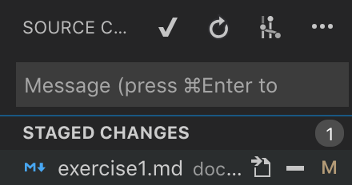

# Exercise 1

## GIT Practice
### Commands to use:
- git clone
- git branch
- git branch \<branch>
- git checkout
- git push
- git pull
- git fetch
  
#### We'll go over some others: 
- git add 
- git commit -m \<message>
- git stash
- git status

### Create a Pull Request at the end.

Work in visual studio code or any IDE you prefer

#### Clone the STRAX-QA Repo
- Navigate to a folder where you have github repos or a documents folder.
- Open up the console. 
- Run the command `git clone https://github.com/GroupCareTech/strax-qa`

#### Create our own branches
- Let's see the current branches 
  - Still in the console, run `git branch`
- Create our own branch
  - Run `git branch <branch name>`
- We will have to checkout our newly created branch. It does not automatically switch branches
  - Run `git checkout <newly created branch>`

#### See other branches
- Git fetch allows us to see new branches
- If we want to see the code difference on those branches `git checkout` is needed

#### Make a change
- Navigate to strax-aif-box
  - `cd strax-aif-box`
- Create a file: a.txt
  - Use either the visual studio gui
  - or the unix command: `touch a.txt`
- In that file, type your name. 
- Save the file.

#### Commit the change
- Command line approach
  - Before we can commit, we must stage the changes
    - Run command - `git add a.txt`
      - Can also be ran `git add .`
        - The period means all changes
    - Now your change is staged
  - In the console, run command `git commit -m <message>`
  - The -m parameter is for attaching a message with the commit
    - Which is usual
  - Your staged changes are now committed
- Visual Studio Code GUI 
  - This is what the source control looks like in Visual Studio Code 
  
  - Now for the commiting
  - Click on the changes you want to stage
  
    - Click on the plus
  - The File will now appear in the staged
  
  - Type a message to go with the changes
    - Command + Enter to commit 
  - Your staged changes are now committed

#### Push to Remote
- Our commit is local and in order to push to the remote
  - Run command `git push`
    - Only affect our own branch
- Our remote branch should now be up to date with our local
  
When we are done, lets do a Pull Request. Merge your code with the master branch in the cloud.

#### Switch Branch - Git pull
- We'll practice the `git pull` command
- Switch branch with a friend
  - Safe way
    - Run command `git fetch` to make sure you can see their branch
    - Run command `git branch` to see all the branches 
    - Run command `git checkout <friend branch>`
  - Or you can just `git checkout <friend branch>`
- Navigate to the root of the strax-aif-box if you aren't already there
- Create another file: b.txt
- Commit and push
- Now checkout/switch to your original branch
- run `git status`
  - Git Status tells us our branch status
    - If we need to push or pull
- We should get a notification saying we are 1 behind
  - so we need run command `git pull`
- We should now be in line with our remote branch
  - We should have b.txt

#### Pull Request
- Navigate in your browser to the repository
  - https://github.com/GroupCareTech/strax-qa
- Click on the tab for Pull requests
  - https://github.com/GroupCareTech/strax-qa/pulls
- Click on the new Pull Request button

- Choose your branch

- Window should update with your changes vs master
- You can also use the pull request way to merge master into your branch
- From here you can add reviewers and write comments
  - The essential part of pull requests!
- Then if you are satisfied, you can click on the Create pull request button. 
  - That will create the pull request. It will appear in the table of open pull requests and your reviewers will be notified.
- Next part is for the reviewer
  - The reviewer will check out your code and then approve and merge your pull request
- Now your code is in the remote/origin master branch
  - It's in the cloud!

In the future, we will run lessons like this. Hands On. Have a good weekend. Yay the weekend