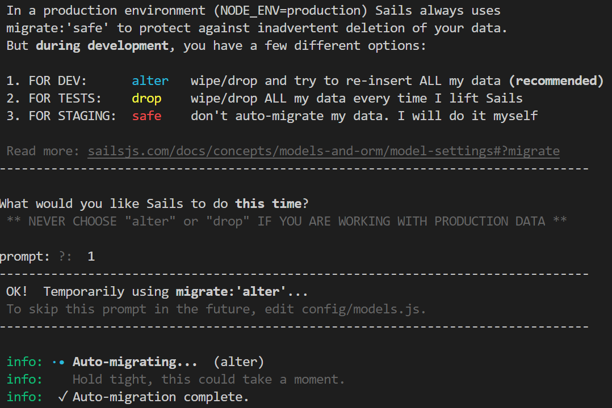
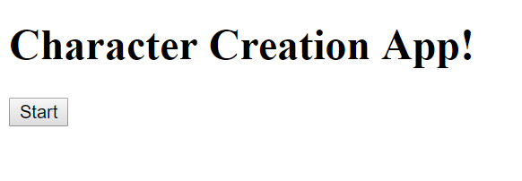
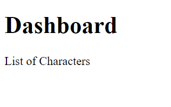
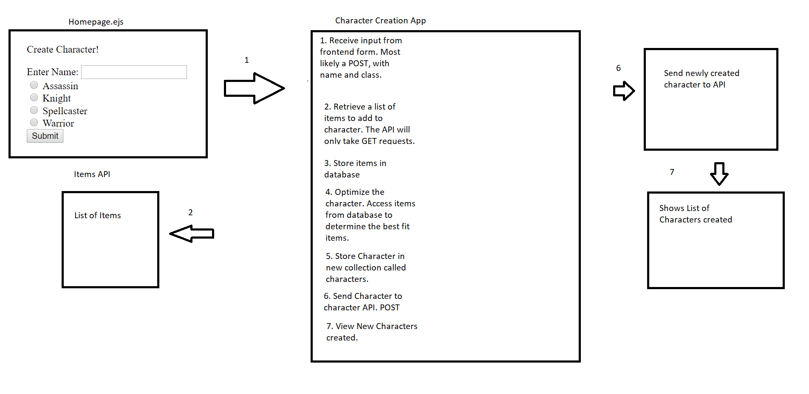
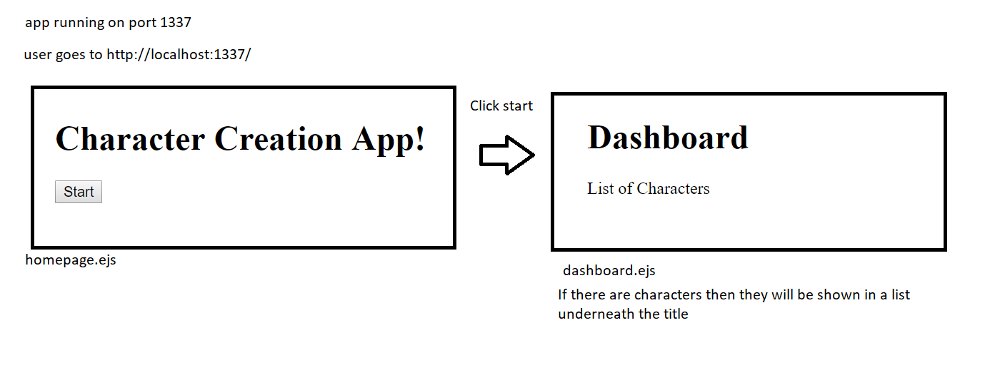
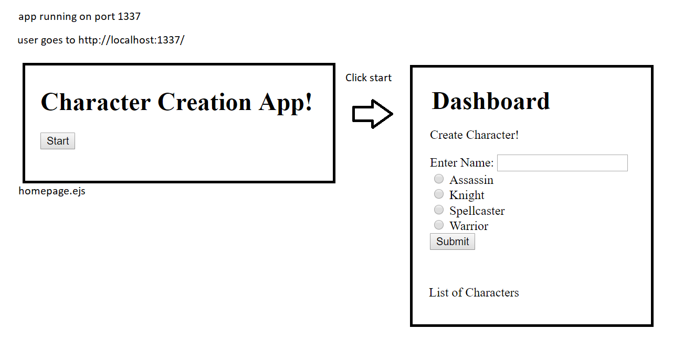
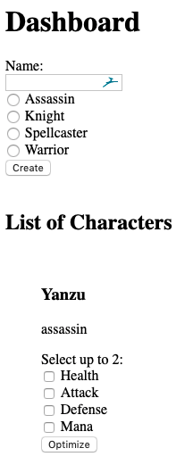

# Homework 7 - RPG Create Character Sails Project

## Table of Contents

[Curriculum](#curriculum) 
| [RPG Create Character Task](#RPG-Create-Character-Task)
| [Overview Tasks](#overview-tasks)

[Characters](#characters)

[Character Classes](#character-classes) 

[Assassin](#assassin)
| [Knight](#knight)
| [Spellcaster](#spellcaster)
| [Warrior](#warrior)

[Items](#items)

[Tasks](#tasks)

 [Part 1: Sails](#part-1-initialize-sails)
| [Part 2: Sails](#part-2-continue-sails)
| [Part 3: Routes](#part-3-initial-routes)
| [Part 4: Mongo](#part-4-mongo)
| [Part 5: Input](#part-5-input)
| [Part 6: Optimize](#part-6-optimize)
| [Part 7: Finalize Character](#part-7-finalize-character)
| [Part 8: Docker](#part-8-docker)

 [Tips](#tips)
| [Mock Ups](#mock-up)
| [Final Thoughts](#final-thoughts)

## Curriculum
- Sails App
  - Ejs frontend
    - input
  - Call an API
    - retrieve data
  - Call another API
    - send data
- Mongo
  - Write to database
  - Retrieve from database
- Logic
  - Optimizing items
  - statistics

## RPG Create Character Task
Using Sails, create a program that will take in input 
and fetch from an outside api.
The app will then decide the optimal items for the character.
Then (save the character) output the character to a database 
and sends the character to another API 
then shows them on a character page.

## Overview Tasks
- Creat a sails app - name it whatever you see relevant to a character creation app
  `sails new CreateCreation`
- Create front page in ejs
  - Input for each character class
- Call Outside API `https://create-character-items.herokuapp.com/items`
  - GET Items 
- Store Items in database
- Create Character
  - initially no items
    - optimize button for the character
- Optimize logic
  - Loops
  - Arrays
- Update the Character with the items
- Finalize creating the character by sending to character page
  - Call Outside API ________________ (logan needs to fill)
    - POST with Character
- view the character page
  - character page: ________________ (logan needs to fill)

## Characters

Base character structure

    Character {
      name: string,
      class: string,
      attributes: {
        health: number,
        attack: number,
        defense: number,
        mana: number,
      },
      gear: {
        head: object,
        chest: object,
        legs: object,
        gauntlets: object,
        rings: array of objects,
        boots: object,
      }
    }

Added in data types. 
Attributes are sums of the items the character is wearing. Plus the initial starting values.

### Character classes

#### Assassin
Cloth and Leather wearer.

Starting values include: 

    attributes: {
      health: 10,
      attack: 10,
      defense: 10,
      mana: 10,
    }

#### Knight
Plate wearer.

    attributes: {
      health: 15,
      attack: 10,
      defense: 10,
      mana: 5,
    }

#### Spellcaster
Cloth wearer.

    attributes: {
      health: 10,
      attack: 10,
      defense: 5,
      mana: 15,
    }

#### Warrior
Plate wearer.

    attributes: {
      health: 15,
      attack: 5,
      defense: 15,
      mana: 5,
    }

## Items

### Structure: 

    {
      name: string,
      slot: string,
      type: string,
      attributes: {
        health: number,
        attack: number,
        defense: number,
        mana: number,
      }
    }

Slot values:
head, chest, legs, gauntlets, rings, boots

Type values:
cloth, leather, plate

Rings do not have type

 

    <b><a href="#----">↥ back to top</a></b>

 

This project will broken into parts.

## Tasks

### Part 1 Initialize Sails
- Create Sails app
  - Select the raw Sails App - Option 2
  - learn the structure
  - comment out some designs

### Part 2 Continue Sails
Design what you need
- Controllers?
- Models? 
- Routes?
- Pages? (HTML)

Models: Characters, Items

Use the api command

`sails new api characters`

`sails new api items`

when you lift up with the api

You can avoid this by uncommenting the line
`migrate: 'alter'` in the models.js file

 - create a controller - Main controller for the app
    - `CreateCharacterController.js`
  - design routes in `routes.js`
  - lookover the ejs in the views folder
    - design some forms
      - don't code them!
        - Design! -->

Choose when to override the blueprints

Example: Homepage

Example: Dashboard

Characters should be shown underneath

### Part 3 Initial Routes
- Create Getting Started route
  - can be a POST
    - similar to the number game start game
  - should lead you to the dashboard - a view of characters
    - don't need dashboard right now
      - doesn't hurt to lead you to another view tho
  - most likely call a controller function
    - get items 
      - created with blueprint if `sails generate api items` was used
    - get characters
      - created with blueprint if `sails generate api characters` was used
    - sails blueprints
      - https://sailsjs.com/documentation/concepts/blueprints
      - https://sailsjs.com/documentation/concepts/blueprints/blueprint-routes
      - 
- Call API (LOGAN)
  - GET route to url: https://create-character-items.herokuapp.com/items
  - test the route by logging out the items
  - hard code this route
    - most likely in the function
- Create `Optimize` route 
  - parameters
    - id of character
    - specs
  - return back to dashboard
- Create `create character` route
  - On the dashboard to create the character
  - POST
    - create a characer to the database
    - return to the dashboard with the updated character list
  - In Sails if you use the `sails generate api characters` you already have this route
    - POST /characters
      - request body should include the necessary things
        - name
        - charClass 
      - However, you will have to override the character route in order to route back to the dashboard 
        - create a function in the Characters Controller
          - called `create`
  - return back to dashboard
- Create `finalize character` route
  - this will be used later
    - POST to the other outside API
    - url: _______

#### Route Path
1. Getting Started on the homepage 
   1. button to advance to dashboard
2. Dashboard 
   1. Get Items
      1. this is used to sync the items with your database
   2. Get Characters
      1. get list of characters
   3. Dashboard page of characters
      1. options
         1. optimize
3. Create Character
   1. take in input
      1. name
      2. charClass
         1. radio button
   2. In sails, you use the blueprint, 
      1. POST to /characters
      2. return back to dashboard
4. Optimize Character
   1. take in input
      1. character
         1. character should be stored in db
         2. without gear
      2. what attributes to optimize
         1. health
         2. attack
         3. defense
         4. mana
   2. result should be character geared
5. Send final Character
   1. finalize character route
   2. post the character

### Part 4 Mongo
- Setup Mongo
  - locally
    - download from here: https://docs.mongodb.com/manual/installation/
- Connect Sails to Mongo https://sailsjs.com/documentation/tutorials/using-mongo-db
- Store Items in to mongo
  - each time you click on getting started to go to dashboard
    - retrieve items and sync
    - make sure the items from the server match the items that your app has

### Part 5 Input
- Take Input for creating the character
  - name
  - charClass
- form
  - button 
    - submit
      - similar to the getting started
  - input
    - typing character name
  - look up radio button
    - can only select 1 class
- Write the character to the database
  - make sure character collection exists
    - Characters
  - Create new character collection if you don't have one
    - before you run the app

### Part 6 Optimize
- Character has no items
- Character on the dashboard has option for optimize
  - Call the optimize route

- Optimize items logic
  - Input Class
    - Assassin
    - Knight
    - Spellcaster
    - Warrior
  - Input optimization option
    - max health
    - max attack
    - max mana
    - max defense
  - can pick 2
  - checkboxes?
  
- Update the character in the database
- return to the dashoard

### Part 7 Finalize Character
- Create button for outputting character to the character page
  - Send data to next api
    - Send the created character
  - POST
    - finds character you selected
    - calls next api
      - request body of character
  - return back to dashboard
- View output on next api (LOGAN)

### Part 8 Docker
- Dockerize
  - local docker

## Tips
- Example Number game is a helper.
- Todo app you guys made is a helper.
- Use logging
  - captains log
    - different types of logging
      - silly
      - verbose
      - info
      - error
      - warn
      - debug
- Error checking 
  - input
    - check for valid input
      - character route should expect a character
        - if not then return
      - optimize route
        - expects attributes
          - if none then return
  - slots
    - Chestpiece cannot go in helmet slot
- Read the writeup multiple times

### Mock up
Old mockup: Left here for design thoughts

<!--  -->
Parts 1 and 2

Parts 3

Parts 6

Added in optimize options

## Final Thoughts
This will get you "geared" for SAIF. Make sure you read it over.

