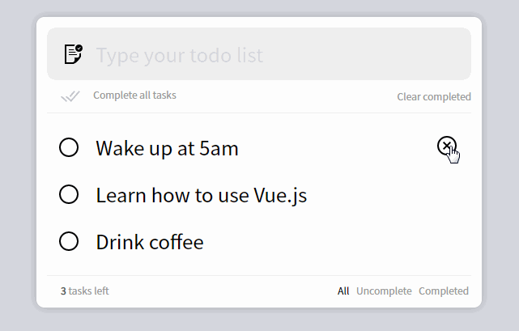

# Lesson 7

## Todo App Route Writeup and Design

https://vuejsexamples.com/a-basic-todo-list-style-single-page-web-application-use-vue-js/

This is an  example of a todo list coded in vue. Single page application and the todos are stored in local storage. 

## Start with the basics
Lets say we are building this in SailsJs. And we have a mongo db attached. 

- Routes?
- Controllers?
- Functions?
- Don't worry about the aesthetics. 

### Routes
When app first loads, show all the todos. 
GET from the server. 
GET /todo
respond with all the todos from the database

Create the Todo. Enter into form.
POST to the server
server responds back with an updated page of the todos
returns a find all from the database

Update the todo. When you click on it to cross it off your list.
PUT to the server with the todo id
PUT /todo/id
respond with updated list of todos
returns a find all from the database

Clear completed option. 
DELETE to the server with the todo id
DELETE /todo/id
respond with updated list of todos
returns a find all from the database

#### Filters (Bottom Right)
Filters
GETs
GET /todo
query parameter depending what option you select
- All
- Incomplete
- Completed

GET /todo?filter=all
GET /todo?filter=incomplete
GET /todo?filter=completed

#### Bottom Left (Count)
I will have a local variable storing the count from all the responses.

### Controllers
Most likely just make 1. `TodoController.js`

### Functions
A function to handle the gets
GET /todo

Update the todo
PUT /todo/id

Create the todo
POST /todo/id

Clear the completed
DELETE /todo/id
